# Git and Github

This repository contains the configuration  for the github repository   that will be used when creating the repository. The configuration for the github repository will be available   in the repository configuration file at https://github.com/github/                          

## Basic Git commands

Demonstate minimum 15 basic Git commands with explanation and screenshots.
1. config

    The git config command is a convenience function that is used to set Git configuration values on a global or local project level.

    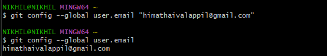
    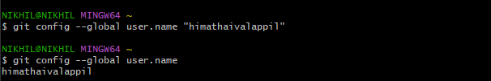

    If you wish to see your configuration settings, use the **git config --list** command to display them all.

2. init
   
    Initializes an existing directory as a Git repository.

    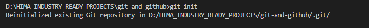

3. clone
   
    Retrieve an entire repository from a hosted location via URL

    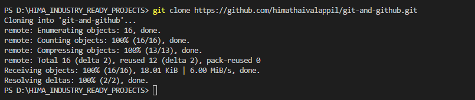

4. status
   
    Shows modified files in working directory, staged for your next commit

    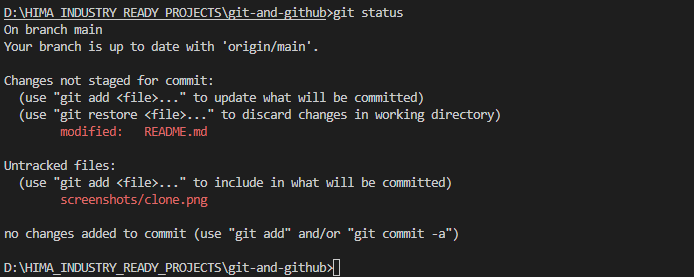

5. diff
   
    By default git diff will show you any uncommitted changes since the last commit.

    git diff --staged will only show changes to files in the "staged" area.

    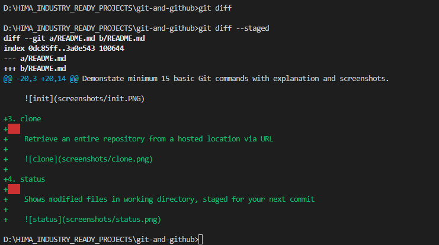

6. push
    
    The git push command is used to upload local repository content to a remote repository. Pushing is how you transfer commits from your local repository to a remote repo.

    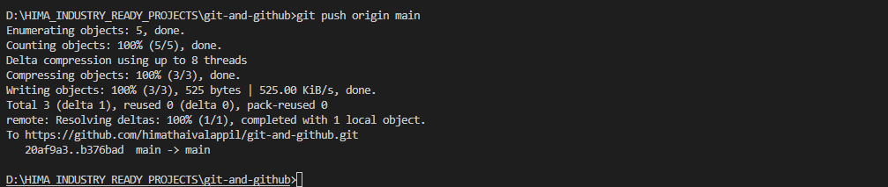

7. pull

    The git pull command is used to fetch and download content from a remote repository and immediately update the local repository to match that content.

    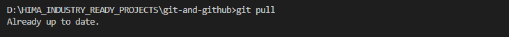

8. add

    The git add command adds a change in the working directory to the staging area. It tells Git that you want to include updates to a particular file in the next commit. However, git add doesn't really affect the repository in any significant way—changes are not actually recorded until you run git commit 

    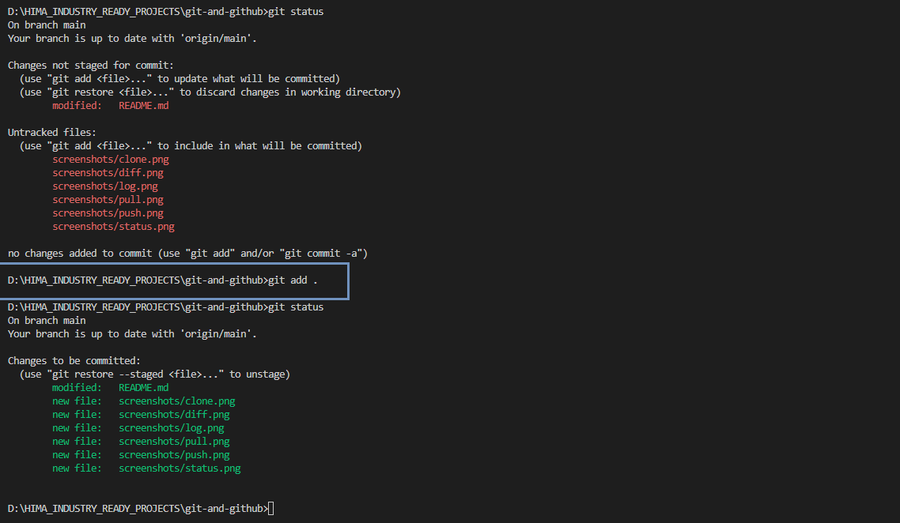

9. commit
    
    The git commit command captures a snapshot of the project's currently staged changes.

    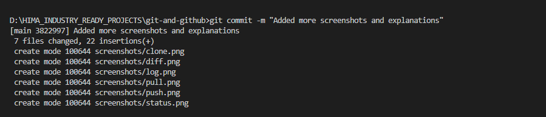

10. branch

    Lists your branches. A * will appear next to the currently active branch

    **git branch**  -  List all of the branches in your repository. This is synonymous with **git branch --list**.

    Rename the current branch using **git branch -M newname**

    **git branch \<branch\>**  -  Create a new branch called ＜branch＞. This does not check out the new branch.

    **git branch -d \<branch>** - Delete the specified branch. This is a “safe” operation in that Git prevents you from deleting the branch if it has unmerged changes.

    **git branch -D \<branch>** - Force delete the specified branch, even if it has unmerged changes. This is the command to use if you want to permanently throw away all of the commits associated with a particular line of development.

    **git branch -a**  -  List all remote branches. 

    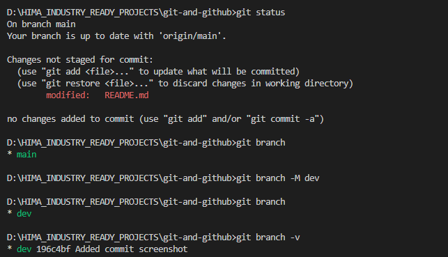

    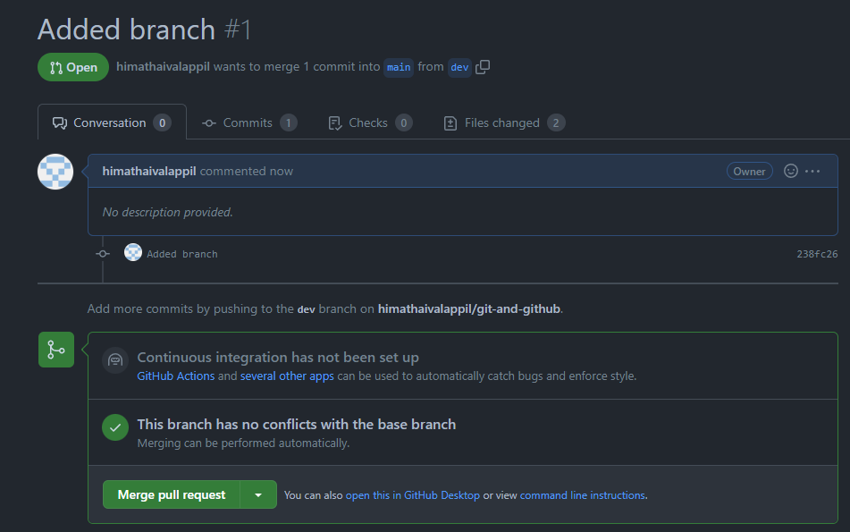

11. log
    
    Shows all commits in the current branch’s history.

    **git log --oneline** shows one commit per line, the first seven characters of the SHA, and the commit message.

    

12. rm

    Deletes the file from project and stage the removal for commit

    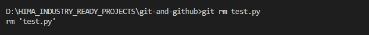

13. mv

    **git mv [existing-path] [new-path]**

    Changes an existing file path and stage the move

    
    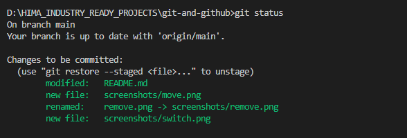

14. switch

